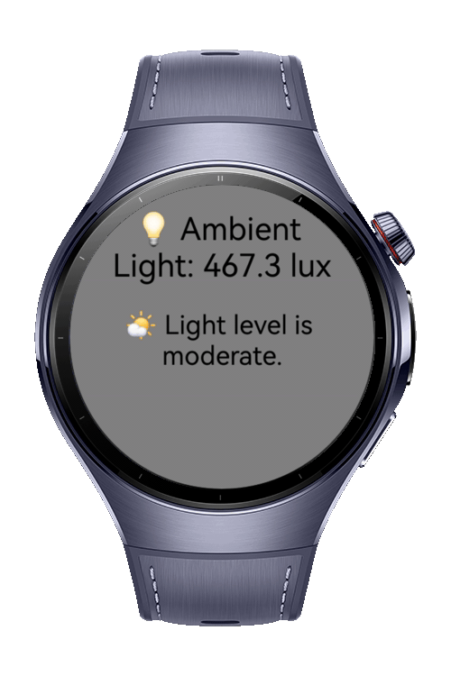

> **Note:** To access all shared projects, get information about environment setup, and view other guides, please visit [Explore-In-HMOS-Wearable Index](https://github.com/Explore-In-HMOS-Wearable/hmos-index).


# How to use light sensor

SmartLux is a HarmonyOS application that reads the real-time ambient light (lux) using the device's light sensor and dynamically adjusts the UI theme and brightness logic accordingly. It also supports background execution to keep monitoring light changes even when the app is minimized.

# Preview
<div>

</div>

# Use Cases

- Real-time ambient light (`lux`) reading via `SensorServiceKit`
- Dynamic background and text theme updates
- Console logging of calculated brightness values
- Background service using `startBackgroundRunning`
- Fast and reactive UI without manual interaction
- Ready for enhancement with screen brightness APIs

# Technology
## Stack
- **Languages**: ArkTS, ArkUI
- **Frameworks**: HarmonyOS SDK 5.1.0
- **Tools**: DevEco Studio 5.1.0
- **Libraries**: 
  - @kit.ArkUI
  - @kit.SensorServiceKit
  - @system.brightness
  - @ohos.resourceschedule.backgroundTaskManager
  - @kit.AbilityKit

## Required Permissions
- ohos.permission.KEEP_BACKGROUND_RUNNING
- ohos.permission.RUNNING_LOCK

# Directory Structure

```
/entry
 ├── /src
 │   ├── /main/ets
 │   │   └── Index.ets              # SmartLux main UI
```

# Constraints and Restrictions
## Supported Device
- Huawei Watch 5

## Limitation
> Programmatic brightness adjustment using `@system.brightness.setValue()` **is only supported in system-level apps** starting from **API version 7** and above. For third-party apps, only visual feedback (UI color changes, notifications, etc.) is recommended.

# LICENSE
**Smart Lux** is distributed under the terms of the MIT License.
See the [license](/LICENSE) for more information.